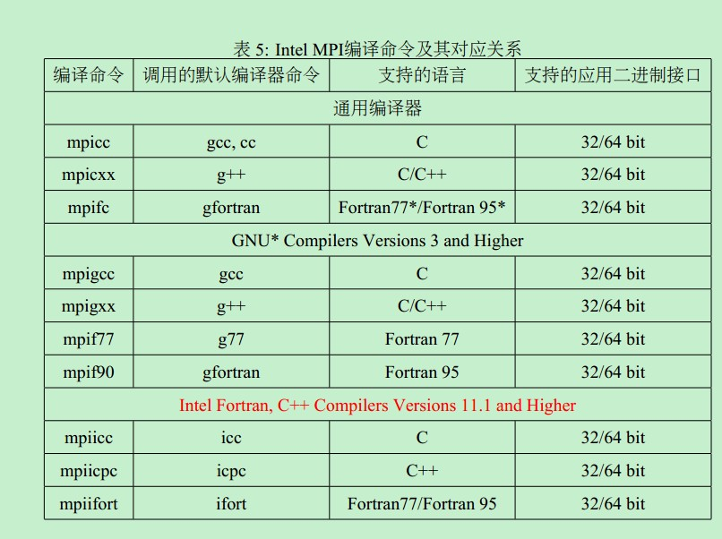

# MPI

## 一、概念

**Message Passing Interface（消息传递接口）**是一种标准化的消息传递协议，用于**分布式内存并行计算**。

## 二、安装

### （一）在 Windows 中

[下载地址]([Microsoft MPI - Message Passing Interface | Microsoft Learn](https://learn.microsoft.com/en-us/message-passing-interface/microsoft-mpi#ms-mpi-downloads))，找到 MS-MPI Downloads 栏，在该处下载 2 个安装包：`msmpisetup.exe` 和 `msmpisdk.msi` 。随后分别双击两个安装包，两个安装包的内容可以装到同一个文件夹下。最后在终端中输入命令 `set msmpi` 查看是否安装成功。

- `msmpisetup.exe`  是 MPI 的**运行时**库
- `msmpisdk.msi` 是 MPI 的**开发时**所需库，包含头文件和库文件，用于编译 MPI 程序

```
$ > set msmpi
MSMPI_BENCHMARKS=E:\software\MPI\Benchmarks\
MSMPI_BIN=E:\software\MPI\Bin\
MSMPI_INC=E:\software\MPI\Include\
MSMPI_LIB32=E:\software\MPI\Lib\x86\
MSMPI_LIB64=E:\software\MPI\Lib\x64\
```

## 三、配置

在 Linux 中可以使用  `mpicc` 命令来编译程序，但是在 Windows 中，是没有 `mpicc` 或者 `mpicxx` 的，只有一个 `mpiexe` 用来执行编译所得的 `.exe` 文件。



#### 回顾：运行一个C程序的步骤

- 假如有一个写好了的 C 语言文件：`hello_world.c`

- 步骤 1：**预处理（Preprocessing）**,即展开头文件、宏定义、条件编译

 `- o` 表示指定输出文件的名字，后缀 i 表示预处理文件，`-E` 表示只进行预处理，如果不加参数，gcc默认生成 `exe` 文件

```
gcc -E hello_world.c -o hello_world.i
```

- 步骤 2：**编译（Compilation）**，将预处理后的 C 代码编译成**汇编代码**，后缀 s 表示汇编文件，`- S` 表示止步到编译这一步

```
gcc -S hello_world.i -o hello_world.s
```

-  步骤 3：**汇编（Assembly）**，将汇编代码转换成**二进制代码（目标文件，后缀 o，-c 表示止步到汇编）**

```
gcc -c hello_world.s -o hello_world.o
```

- 步骤 4：**链接（Linking）**，链接库文件（头文件）生成可执行文件`.exe`，后缀名也可省略

```
gcc hello_world.o -o hello_world
```

- 步骤 5：**运行（Execution）**

```
./hello_world
```

- 一步到位的方法是：

其实只需要写 编译（姑且这样称呼，其实不太准确）、执行两步

```
gcc hello.c -o hello.exe
./hello.exe
```

- `makefile` 的作用类似于 python 中的 shell 脚本，适用于工程中，写明了各个文件的执行步骤

#### 在 Windows 中使用 MPI 运行 C 程序的步骤

- 编译

```
g++ 文件名.cpp -o 文件名 -I mpi的Include路径 -L mpi的Lib/x64路径 -lmsmpi
# 具体可写作
g++ test.cpp -o test.exe -I "E:\software\MPI SDK\Include" -L "E:\software\MPI SDK\Lib\x64" -lmsmpi
```

- 运行

```
mpiexec test.exe（exe程序名字）
# 可指定进程数目
mpiexec -n 4 test.exe
# 若没有为 mpiexec 添加环境变量，则需要写作
E:\\software\\MPI\\Bin\\mpiexec test.exe
```

#### 配置 VS code 用以执行 MPI（【bug】可能存在问题，有时不起作用）

VS code 自动生成的使用  `g++`  执行程序的配置一般是

```
{
    "type": "cppbuild",
    "label": "C/C++: gcc.exe 生成活动文件",
    "command": "E:\\software\\gcc\\mingw64\\bin\\gcc.exe",
    "args": [
        "-fdiagnostics-color=always",
        "-g",
        "${file}",
        "-o",
        "${fileDirname}\\${fileBasenameNoExtension}.exe"
    ],
    "options": {
        "cwd": "${fileDirname}"
    },
    "problemMatcher": [
        "$gcc"
    ],
    "group": {
        "kind": "build",
        "isDefault": true
    },
    "detail": "调试器生成的任务。"
}
```

此时需要新增配置

```
// 这里是指定命令行参数的
"args": [
        "-fdiagnostics-color=always",
        "-g",
        "${file}",
        "-o",
        "${fileDirname}\\${fileBasenameNoExtension}.exe",
        // 以下是新增设置
        "-I",
        "E:\\software\\MPI SDK\\Include",
        "-L",
        "E:\\software\\MPI SDK\\Lib\\x64",
        "-lmsmpi"
    ],
```

## 四、与 Java 中多线程的区别

#### 相似之处

都是并发执行，可加速计算

#### 核心区别

- MPI 它是在执行当前程序时，创建了多个副本一起执行；而多线程是在一个程序内部设置多个分支

- MPI 进程不是在代码内部创建的，而是**在运行 `mpiexec` 命令时由 MPI 运行时系统创建的**

| 区别     | MPI (进程级并行)                       | Java 多线程                           |
| -------- | -------------------------------------- | ------------------------------------- |
| 内存模型 | 分布式内存 - - -每个进程有独立内存空间 | 共享内存 --- 所有线程共享同一内存空间 |
| 通信方式 | 显式消息传递 (`MPI_Send`, `MPI_Recv`)  | 直接内存访问 + 同步机制               |
| 隔离性   | 高 --- 一个进程崩溃不影响其他进程      | 低 --- 一个线程崩溃可能影响整个程序   |
| 扩展性   | 可跨多台机器                           | 限于单台机器                          |

#### 总结

- **Java 多线程**像是**一个办公室里的团队**，大家共享白板、文件柜，沟通方便但容易互相干扰
- **MPI** 像是**分布在不同城市的团队**，各自独立工作，通过电话/邮件明确通信，隔离性好但沟通开销大

## 五、MPI 使用前后 C 语言程序执行效果对比

- 不使用 MPI ：`serial_hello.c`

```
#include <stdio.h>
#include <windows.h>

int main() {
    printf("=== 串行程序运行结果 ===\n");
    
    // 进入循环
    for (int i = 0; i < 3; i++) {
        printf("进程执行任务 %d\n", i);
        Sleep(1000); // 暂停1秒模拟工作
    }
    
    printf("程序执行完毕！\n");
    return 0;
}
```

- 使用 MPI：`mpi_hello.c`

```
#include <stdio.h>
#include <mpi.h>
#include <windows.h>

int main(int argc, char** argv) {
    int rank, size;
    char processor_name[MPI_MAX_PROCESSOR_NAME];
    int name_len;
    
    // 初始化MPI环境
    MPI_Init(&argc, &argv);
    
    // 获取当前进程的编号（rank）和总进程数（size）
    MPI_Comm_rank(MPI_COMM_WORLD, &rank);
    MPI_Comm_size(MPI_COMM_WORLD, &size);
    MPI_Get_processor_name(processor_name, &name_len);
    
    // 只有rank 0进程打印总信息
    if (rank == 0) {
        printf("=== MPI并行程序运行结果 ===\n");
        printf("总进程数: %d\n", size);
        printf("每个进程将并行执行任务！\n\n");
    }
    
    // 等待所有进程同步
    MPI_Barrier(MPI_COMM_WORLD);
    
    // 每个进程并行执行自己的任务
    printf("进程 %d (在计算机 %s 上) 开始工作...\n", rank, processor_name);
    
    for (int i = 0; i < 3; i++) {
        printf("进程 %d 执行任务 %d\n", rank, i);
        Sleep(1000); // 每个进程独立暂停1秒
    }
    
    printf("进程 %d 工作完成！\n", rank);
    
    // 等待所有进程完成
    MPI_Barrier(MPI_COMM_WORLD);
    
    // 只有rank 0进程打印结束信息
    if (rank == 0) {
        printf("\n所有进程工作完成！\n");
    }
    
    // 终止MPI环境
    MPI_Finalize();
    return 0;
}
```

编译 MPI 程序

```
mpicc mpi_hello.c -o mpi_hello.exe
```

运行 MPI 程序，其中 `-n 4` 表示启动 4 个并行的进程，这个是 `mpiexec` 的命令

```
mpiexec -n 4 mpi_hello.exe
```

此时的执行步骤是：

```
mpiexec 命令
    ↓
MPI 启动器解析 -n 4 参数
    ↓
创建 4 个操作系统进程
    ↓
每个进程加载并运行 mpi_hello.exe
    ↓
MPI_Init() 建立进程间的通信连接
```

运行结果可能是：

```
=== MPI并行程序运行结果 ===
总进程数: 4
每个进程将并行执行任务！

进程 0 (在计算机 DESKTOP-ABC 上) 开始工作...
进程 0 执行任务 0
进程 1 (在计算机 DESKTOP-ABC 上) 开始工作...
进程 1 执行任务 0
进程 2 (在计算机 DESKTOP-ABC 上) 开始工作...
进程 2 执行任务 0
进程 3 (在计算机 DESKTOP-ABC 上) 开始工作...
进程 3 执行任务 0
进程 0 执行任务 1
进程 1 执行任务 1
进程 2 执行任务 1
进程 3 执行任务 1
进程 0 执行任务 2
进程 1 执行任务 2
进程 2 执行任务 2
进程 3 执行任务 2
进程 0 工作完成！
进程 1 工作完成！
进程 2 工作完成！
进程 3 工作完成！

所有进程工作完成！
```


