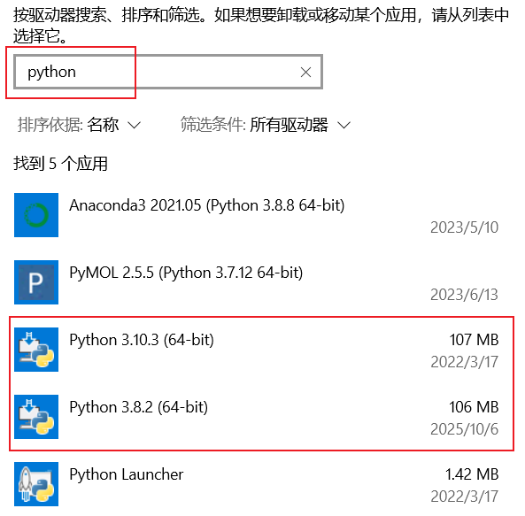

# 依赖管理器 PDM 使用方法

## 一、使用 python 虚拟环境代替 conda

### （一）查看电脑上当前有哪些 python 解释器

```
$> where python
D:\2filerj\anaconda3\python.exe（conda 的base环境）
D:\2filerj\python\python.exe
```

若不激活任何 conda 环境，则只能看到 base 环境的解释器，若激活了某一环境，则该环境的解释器会出现。

```
(PyqtBio) C:\Users\zhangli > where python
D:\2filerj\anaconda3\envs\PyqtBio\python.exe
D:\2filerj\anaconda3\python.exe
D:\2filerj\python\python.exe
```

也可以在 “系统--卸载” 中搜索 python，如果除了 anaconda 之外，还有 python 解释器则说明已安装普通 python 解释器。



### （二） 安装 python 解释器 （若上一步显示仅有 conda 解释器）

打开 python 官网（https://www.python.org/），选择 download--->windows

### （三）查看 python

- 系统 python 解释器并没有激活的概念，只有通过它创建的虚拟环境才可被激活

- 如果不把该解释器的路径添加到 系统环境 中，那么在使用它时，必须要复制完整的路径

  ```
  # 查看版本
  D:\2filerj\python\python.exe --version
  # 查看已有的包
  D:\2filerj\python\python.exe -m pip list
  ```

## 二、创建虚拟环境

1. 创建一个文件夹，用于存放所有的虚拟环境

   ```
   mkdir E:\py_venv
   cd E:\py_venv
   ```

2. 创建一个虚拟环境

   `-m venv` 表示使用该解释器的 `venv` 模块；`test` 是虚拟环境名字

   执行完毕后，会创建一个 test 文件夹。若需要移除该虚拟环境，只需要删除这个文件夹。

   ```
   D:\2filerj\python\python.exe -m venv test
   ```

3. 激活一个虚拟环境，执行完毕之后，命令行开头会出现 `(test)`

   - 对于 Windows

     ```
     E:\py_venv\test\Scripts\activate
     # 或使用相对路径
     .\venv\Scripts\activate
     ```

   - 对于 Mac 和 Linux

     ```
     source test/bin/activate
     ```

4. 若需要退出该虚拟环境

   ```
   deactivate
   ```

## 三、软件安装工具 [Scoop](https://scoop.sh/) 

1. 这是一个自动下载软件的程序，可快速安装，避免 GUI 界面操作，它所下载的程序都自动存放在一个文件夹中统一管理。可用于下载 `Node.JS`、`VS code` 等

2. 自定义安装 Scoop 到指定文件夹

    ```
    irm get.scoop.sh -outfile 'install.ps1'
    .\install.ps1 -ScoopDir 'E:\software\Scoop'
    ```

3. 使用它安装 pipx

   ``` 
   scoop install pipx
   ```

4. 问题处理
   安装成功后，会发现 pipx 无法运行，凡是以 pipx 开头的指令都会显示
   ```
   Python 3.9 or later is required. See https://github.com/pypa/pipx for installation instructions.
   ```

   因为 scoop 中未给 pipx 程序添加默认的 python 解释器导致的，解决方法是手动指定解释器位置，打开 `E:\software\Scoop\apps\pipx\current\pipx.bat` 之后，把
   
   ```
   @pthon "%~dp0pipx.pyz" %*
   ```
   
   改为
   
   ```
   @"D:\2filerj\python\python.exe" "%~dp0pipx.pyz" %*
   ```

5. 配置系统环境变量，使得 pipx 可以在命令行中直接使用

   ```
   pipx ensurepath
   ```

## 四、使用 pipx

### (一) pip 和 pipx 的区别

1. pip 是 python 语言自带的包下载工具。

2. [pipx](https://github.com/pypa/pipx) 是一个用于在**隔离的虚拟环境**中安装和运行 python 应用程序的工具。

   它相当于 Ubuntu 上的 apt ；CentOS 上的 yum；MacOS 上的 brew，都是用来下载应用程序的。 

   pipx 也可以和 pip 一样，从pypi、git 仓库、wheel 中构建程序，它独特的优点是会为每个 python 程序创建一个独立的虚拟环境，这样就可以避免多种 python 程序之间的版本依赖。

### (二) 通过 pip 安装 pipx （除 scoop 外的另一种安装方式）

- 安装 pipx

    加了参数 `-- user` 的话，安装路径不是当前 python 解释器下，而是 `C:\Users\用户名\AppData\Roaming\Python\` ，这样的优点是：

    - *✅ 多个 Python 版本可以共享用户安装的包*
    - *✅ 卸载 Python 时不会丢失用户安装的包*

    ```
    D:\2filerj\python\python.exe -m pip install --user pipx
    # 或简写为
    python -m pip install --user pipx
    ```

- 把 pipx 添加到系统环境中，这样就不需要每次用 pipx 的时候写它的绝对路径了

  ```
  D:\2filerj\python\python.exe -m pipx ensurepath
  ```

- 如果在多个解释器中安装了 pipx，可以通过以下命令查看当前具有哪些 pipx

  ```
  C:\Users\zl > where pipx
  c:\Users\zl\AppData\Roaming\Python\python310\Scripts\pipx.exe
  ```

### (三) 其他 pipx 命令

- 查看 pipx 版本

  ```
  pipx --version
  ```
  
- 查看 pipx 的配置，它的数据默认存储在 C盘的用户目录下

  ```
  pipx environment --verbose
  ```
  
- 查看通过 pipx 安装的程序

  ```
  pipx list
  ```
  

## 四、安装 PDM

1. 使用 pipx 安装 pdm 作为全局命令

    ```
    pipx install pdm
    # 加上参数 --verbose 可以看到安装过程的具体细节
    pipx install pdm --verbose
    ```

2. 问题处理

    pipx 在安装 pdm 时可能会失败，报错显示问题存储在错误日志中

    ```
    Fatal error from pip prevented installation. Full pip output in file: C:\Users\zl/.local/pipx/logs/cmd_2025-10-06_16.56.06_pip_errors.log
    ```
    日志内容如下，主要是指缺少了 pip 模块
    ```
    PIP STDOUT
    ----------
    
    PIP STDERR
    ----------
    C:\Users\zl\pipx\venvs\pdm\Scripts\python.exe: No module named pip: No module named pip
    ```
    在 pipx 的仓库主页有非常多的 issue 都提到这个问题：
    
    ```
    https://github.com/pypa/pipx/issues/778 （解决办法无效）
    ```
    
    - 其中提到：新版本 pipx 为了提升性能和节省空间，不再在每个虚拟环境中安装 pip。而是创建一个共享的 pip 安装（在 C:\Users\zl\pipx\shared\）
   ```
   https://github.com/pypa/pipx/issues/888 （解决办法有效）
   ```
   - 问题原因是，`python.exe` 和 `site-packages` 都位于 `C:\Users\zl\pipx\shared` 路径中，但是 pipx 在安装 pdm 程序的时候却企图去 `C:\Users\zl\pipx\venvs\pdm` 路径下寻找解释器和依赖库。当实际上，`C:\Users\zl\pipx\venvs`文件夹为空，并没有叫 `pdm` 的文件夹。
   
   - 解决方法是，复制  `shared` 路径下的 `Script` 和 `Lib` 文件夹到 `envs/pdm` 文件夹下，再此执行安装 pdm 命令，显示：
   
     ```
     'pdm' already seems to be installed. Not modifying existing installation in 'C:\Users\张丽\pipx\venvs\pdm'. Pass
     '--force' to force installation.
     ```
   
   - 这是因为 `pdm` 文件夹已经存在了，导致 pipx 认为该程序已经安装了，此时只需要按照上面的提示，使用 `--force` 参数即可
   
     ```
     $ > pipx install pdm --force
     Installing to existing venv 'pdm'
       installed package pdm 2.25.9, installed using Python 3.10.3
       These apps are now globally available
         - pdm.exe
     done! ✨ 🌟 ✨
     ```


3. 测试 pdm 是否安装成功

    ```
    $ > pdm --version
    PDM, version 2.25.9
    ```

## 四、使用 PDM

### (一) 通过 PDM 新建一个“标准化”的 python 项目

1.  `cd` 到想要创建项目的文件夹中，执行以下命令

      ```
      pdm new 项目名称
      ```

    ``` 
    E:\PINN> pdm new test
    Creating a pyproject.toml for PDM...
    Please enter the Python interpreter to use
     0. cpython@3.8 (D:\2filerj\anaconda3\python.EXE)
     1. cpython@3.10 (D:\2filerj\python\python.exe)
    Please select (0): 1   【选择一个解释器】
    Virtualenv is created successfully at E:\PINN\test\.venv
    Project name (test):   【按回车】
    Project version (0.1.0):   【按回车】
    Do you want to build this project for distribution(such as wheel)?
    If yes, it will be installed by default when running `pdm install`. 	[y/n] (n): n   【只是开发时，选择 no 】
    License(SPDX name) (MIT):   【按回车】
    Author name (zxcvbnmkj):	【按回车】
    Author email (2693175110@qq.com):	【按回车】
    Python requires('*' to allow any) (==3.10.*):	【按回车】
    INFO: Git repository initialized successfully.
    Project is initialized successfully
    ```

2.  创建好的项目中会包括

   ```
   E:\PINN\test>D:\2filerj\python\python.exe dir_tree.py
   test/
       ├── .venv/   【创建了一个和项目同名的虚拟环境】
       │   ├── Lib/
       │   │   └── site-packages/  【初始不包含任何库，包括 pip】
       │   │       ├── _virtualenv.pth
       │   │       └── _virtualenv.py
       │   ├── Scripts/
       │   │   ├── activate
       │   │   ├── activate.bat
       │   │   ├── activate.fish
       │   │   ├── activate.nu
       │   │   ├── activate.ps1
       │   │   ├── activate_this.py
       │   │   ├── deactivate.bat
       │   │   ├── pydoc.bat
       │   │   ├── python.exe
       │   │   └── pythonw.exe
       │   ├── .gitignore
       │   ├── CACHEDIR.TAG
       │   └── pyvenv.cfg
       ├── .gitignore
       ├── .pdm-python		【PDM 的配置文件，默认处于 .gitignore 中】
       ├── dir_tree.py
       └── pyproject.toml
   ```

3.  激活该虚拟环境，然后命令行开头会出现“ 项目名字 + python 版本 ”

    ```
    E:\PINN\test > .venv\Scripts\activate
    (test-3.10) E:\PINN\test>
    ```

### (二) 为已经存在的项目添加 PDM 管理

`cd` 到项目路径，执行

```
pdm init
```

### (三) 管理依赖

1. 配置 pip 镜像源

   ```
   pdm config pypi.url https://mirrors.aliyun.com/pypi/simple/
   ```

2. 添加依赖

   ```
   $ > pdm add pandas
   Adding packages to default dependencies: pandas
     0:00:10   Lock successful.
   Changes are written to pyproject.toml.
   Synchronizing working set with resolved packages: 6 to add, 0 to update, 0 to remove
   
     v Install six 1.17.0 successful
     v Install python-dateutil 2.9.0.post0 successful
     v Install tzdata 2025.2 successful
     v Install pytz 2025.2 successful
     v Install pandas 2.3.3 successful
     v Install numpy 2.2.6 successful
   
     0:00:12   All complete! 6/6
   ```

3.  使用 pdm 命令查看当前已安装依赖，无需 pip

   ```
   (test-3.10) E:\PINN\test>pdm list
   ┌─────────────────┬─────────────┬──────────┐
   │ name            │ version     │ location │
   ├─────────────────┼─────────────┼──────────┤
   │ numpy           │ 2.2.6       │          │
   │ pandas          │ 2.3.3       │          │
   │ python-dateutil │ 2.9.0.post0 │          │
   │ pytz            │ 2025.2      │          │
   │ six             │ 1.17.0      │          │
   │ tzdata          │ 2025.2      │          │
   └─────────────────┴─────────────┴──────────┘
   ```

4.  再查看 `pyproject.toml` 文件，可看出 `dependencies` 处已更新

   ```
   (test-3.10) E:\PINN\test>cat pyproject.toml
   [project]
   name = "test"
   version = "0.1.0"
   description = "Default template for PDM package"
   authors = [
       {name = "zxcvbnmkj", email = "2693175110@qq.com"},
   ]
   dependencies = ["pandas>=2.3.3"]
   requires-python = "==3.10.*"
   readme = "README.md"
   license = {text = "MIT"}
   
   
   [tool.pdm]
   distribution = false
   ```

5. 生成 `pdm.lock` 文件

   由于 `pyproject.toml` 中并不是写明了每个库的版本，只是大概范围。于时在安装的过程中，会把实际安装的每个库的具体版本写入 `pdm.lock` 文件。

   若有了 `pdm.lock` 文件后，就可以通过 `pdm sync` 命令来直接读取`pdm.lock` 中的信息，从而忽略`pyproject.toml` 的宽泛信息。

6. 删除依赖

   ```
   pdm remove 库名
   ```

6. 在新环境中，根据 `pyproject.toml` 文件，一次性安装所有依赖

   ```
   pdm install (根据 pyproject.toml 信息安装)
   pdm sync (根据 pdm.lock 安装)
   ```

### (四) 使用 pdm 运行程序

```
# 传统方式
.venv\Scripts\activate
python main.py

# PDM 方式,先 cd 到项目中
pdm run python main.py
```

### (五) 常用命令

- `pdm list --graph` 以树状图的形式展示依赖关系

  ```
  E:\PINN\test>pdm list --graph
  pandas 2.3.3 [ required: >=2.3.3 ]
  ├── numpy 2.2.6 [ required: >=1.22.4 ]
  ├── python-dateutil 2.9.0.post0 [ required: >=2.8.2 ]
  │   └── six 1.17.0 [ required: >=1.5 ]
  ├── pytz 2025.2 [ required: >=2020.1 ]
  └── tzdata 2025.2 [ required: >=2022.7 ]
  ```

- `pdm show <package_name>` 展示包的信息

  

