# Java Web后端构建，从实践出发

## 一、环境准备

1. java（也可不自己安装，直接在 IDEA 中新建项目的时候一键安装）

- 版本说明，使用最多的版本就是 java 8

```
Java 1.0 → Java 1

Java 1.2 → Java 2

Java 1.5 → Java 5 (开始简化命名)

Java 1.8 → Java 8 (最经典的版本)

从 Java 9 开始，完全弃用 1.x 命名，直接叫 Java 9、10、11...
```

- SpringBoot 3 只能使用 java 17 及以上的版本开发

2. Maven 3

检查是否安装

```
mvn -version
```

## 二、通过 IDEA 快速创建一个 SpringBoot 项目

**选择基本信息，可直接从 spring 的官网下载模板**

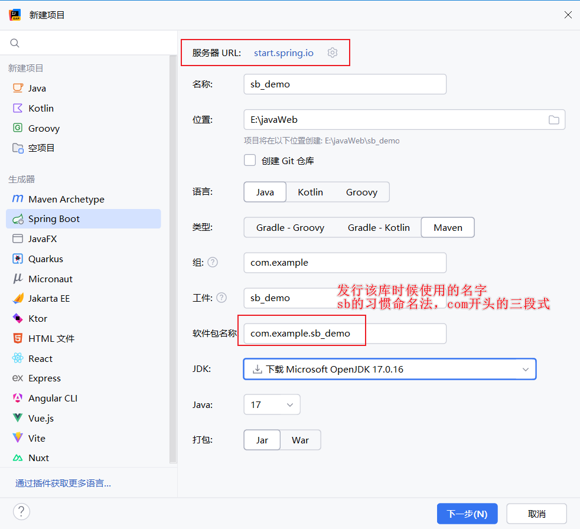

**通过 IDEA 下载 jdk **

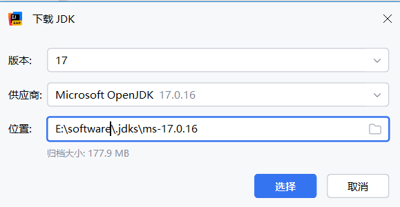

**选择依赖**

1. Developer Tools

- Spring Boot DevTools ：**热部署工具**，修改代码后无需手动重启应用就能看到变化
- Lombok（火爆辣椒🌶）：通过注解来消除 java 的大量样板代码（getter、setter等）
- Spring Configuration Processor ：配置提示

2. web

- spring web

3. SQL

- MySQL Driver
- Mybatis Framework

> 现在似乎有一种比较好用的技术 `Spring Data JPA` 可以代替 Mybatis ，该技术更加简洁，避免了直接写 SQL 语句


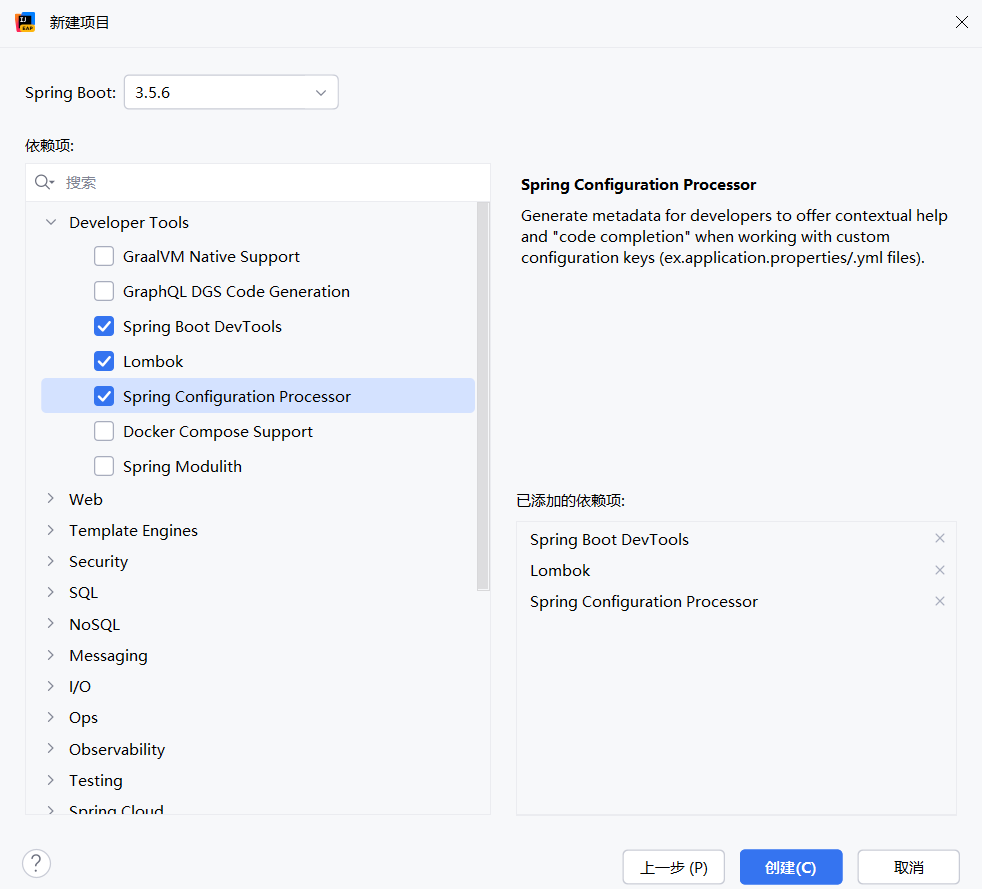

最终生成的项目结构为

```
sb_demo/                          # 项目根目录
├── .mvn/                         # Maven 包装器目录
│   └── wrapper/
│       └── maven-wrapper.properties # Maven 版本配置
├── src/                          # 源代码目录
│   ├── main/                     # 主代码目录
│   │   ├── java/                 # Java 源代码
│   │   │   └── com/
│   │   │       └── example/
│   │   │           └── sb_demo/
│   │   │               └── SbDemoApplication.java  # Spring Boot 启动类
│   │   └── resources/            # 资源文件目录
│   │       ├── static/           # 静态资源 (CSS, JS, 图片等)
│   │       ├── templates/        # 模板文件 (Thymeleaf, FreeMarker等)
│   │       └── application.properties # 应用配置文件
│   └── test/                     # 测试代码目录
│       └── java/                 # 测试Java代码
│           └── com/
│               └── example/
│                   └── sb_demo/
│                       └── SbDemoApplicationTests.java # 自动生成的测试类
├── .gitattributes                # Git 属性配置
├── .gitignore                    # Git 忽略文件配置
├── HELP.md                       # Spring Boot 帮助文档
├── mvnw                          # Maven 包装器脚本 (Linux/Mac)
├── mvnw.cmd                      # Maven 包装器脚本 (Windows)
└── pom.xml                       # Maven 项目配置文件
```

接下来创建文件夹

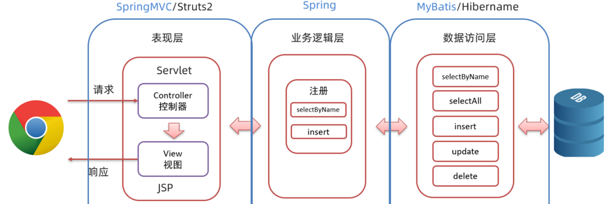

```
com.example.sb_demo/
├── controller/     # 控制器 - 处理HTTP请求
├── service/        # 业务逻辑层
├── repository/     # 数据访问层  
├── entity/         # 实体类
└── config/         # 配置类
```

## 三、问题解决

第一次使用 IDEA 时需要配置 maven，IDEA 可以在新建项目的时候下载 jdk ，但是它不会自动下载 maven，这个需手动下载。最初的 IDEA 的 maven 配置如下，但是这个无法使用，甚至它们可能都不存在。需要改为自己的 maven 路径

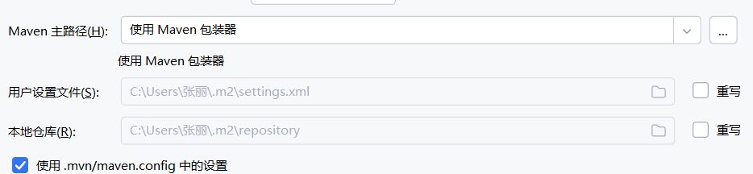

修改后，其中 `settings.xml` 中配置了中央仓库的路径（是国内阿里云，而非国外），这个和配置 pip 下载源一样；MyLocalStore 则是本台电脑的本地 jar 包仓库。

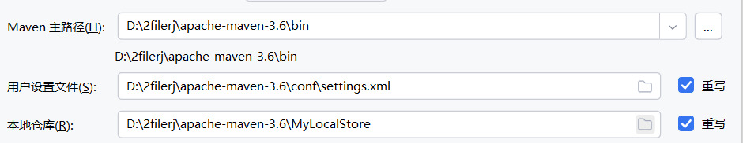

> - pom.xml 中的包下载后以**Maven 坐标**组织的格式存放在本地仓库中
>
> ```
> MyLocalStore/
> ├── org/
> │   ├── springframework/
> │   │   ├── boot/
> │   │   │   ├── spring-boot-starter-web/
> │   │   │   │   ├── 3.5.6/
> │   │   │   │   │   ├── spring-boot-starter-web-3.5.6.jar
> │   │   │   │   │   ├── spring-boot-starter-web-3.5.6.pom
> │   │   │   │   │   └── _remote.repositories
> │   │   │   │   └── maven-metadata-local.xml
> │   │   │   └── spring-boot-starter-parent/
> │   │   │       └── 3.5.6/
> │   │   └── springframework/
> │   │       └── spring-core/
> │   │           └── 6.1.14/
> ├── com/
> │   ├── mysql/
> │   │   └── mysql-connector-j/
> │   │       └── 8.0.33/
> │   │           ├── mysql-connector-j-8.0.33.jar
> │   │           └── mysql-connector-j-8.0.33.pom
> └── org/
>     └── projectlombok/
>         └── lombok/
>             └── 1.18.34/
> ```
> - 默认情况下，所有用 maven 构建的 java 项目都共享一个本地仓库

## 四、建立最基本的接口- - -对一个数据库表进行增删改查

### 创建数据库

- navicat 只可以显示各个表中的内容，但它是无法创建数据库的

- 使用 SQL 语句创建数据库，默认的用户名和密码是：root、123456

```
-- 连接MySQL
> mysql -u root -p
Enter password: ******

-- 创建数据库 springboot_demo
CREATE DATABASE springboot_demo CHARACTER SET utf8mb4 COLLATE utf8mb4_unicode_ci;

--使用该数据库
USE springboot_demo;

--创建表格 user
CREATE TABLE user (
    id BIGINT AUTO_INCREMENT PRIMARY KEY,
    name VARCHAR(100) NOT NULL,
    age INT,
    created_time TIMESTAMP DEFAULT CURRENT_TIMESTAMP,
    updated_time TIMESTAMP DEFAULT CURRENT_TIMESTAMP ON UPDATE CURRENT_TIMESTAMP
);
```

- 使用 IDEA 自带的数据库可视化工具显示数据库（可避免打开 Navicat）

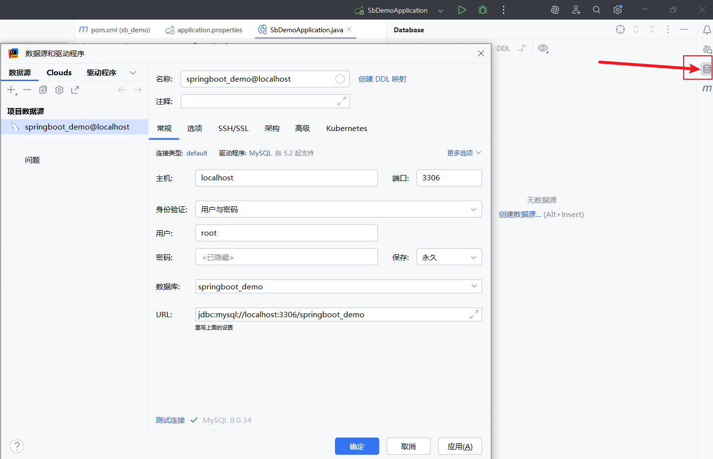

接着就可以看到一个为空的表 user

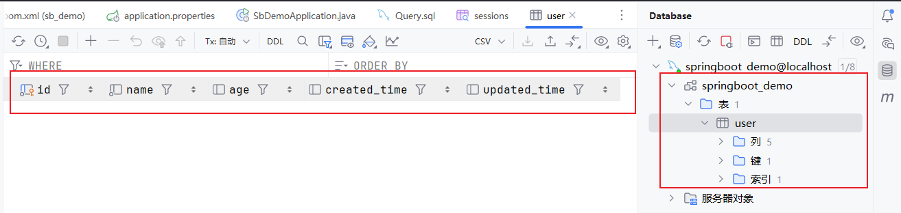

- 在 ` src/main/resource/application.properties` 中配置数据库信息

```
# 模板自带
spring.application.name=sb_demo

# 数据库连接配置
spring.datasource.url=jdbc:mysql://localhost:3306/springboot_demo
spring.datasource.username=root
spring.datasource.password=123456
spring.datasource.driver-class-name=com.mysql.cj.jdbc.Driver
```

### 在 java web 中创建与表格一样的类

- 在 `src/main/java/com/example/sb_demo/` 下面新创建文件夹 `entity`，并创建一个和数据库表名一样的文件名 `User.java`（注意首字母大写）
- 设置驼峰命名自动映射：在`application.properties` 中新增 `mybatis.configuration.map-underscore-to-camel-case=true`

  - 数据库使用 下划线命名（created_time）

  - java 采用驼峰命名法（createdTime）

  - 设置完毕后这一步允许名字不完全一样，JAVA 可自动转换

刚创建文件 `User.java` 的时候 IDEA 就会自动补全，其中 package

```
package com.example.sb_demo.entity;

public class User {
}
```

把数据库表格中的所有字段都作为java的成员变量，其中 `lombok` 使用注解 `@Data` 极大的简化了代码

```
package com.example.sb_demo.entity;

import lombok.Data;
import java.util.Date;

@Data
public class User {
    // Long类型，对应数据库的BIGINT
    private Long id;
    private  String name;
    private  Integer age;
    private  Date createdTime;
    private  Date updatedTime;
}
```

如果不使用 `lombok` 则需要写每一个成员变量的 getting 和 setting 方法

```
package com.example.sb_demo.entity;

import java.util.Date;

public class User {
    // Long类型，对应数据库的BIGINT
    private Long id;
    private String name;
    private Integer age;
    private Date createdTime;
    private Date updatedTime;
    
    // Getter 和 Setter 方法
    public Long getId() { return id; }
    public void setId(Long id) { this.id = id; }
    
    public String getName() { return name; }
    public void setName(String name) { this.name = name; }
    
    public Integer getAge() { return age; }
    public void setAge(Integer age) { this.age = age; }
    
    public Date getCreatedTime() { return createdTime; }
    public void setCreatedTime(Date createdTime) { this.createdTime = createdTime; }
    
    public Date getUpdatedTime() { return updatedTime; }
    public void setUpdatedTime(Date updatedTime) { this.updatedTime = updatedTime; }
}
```

### 写数据库查询的 SQL 语句

在 `src/main/java/com/example/sb_demo/` 下面新创建文件夹 `mapper` ，新建 `UserMapper.java` 接口文件

- `org.apache.ibatis.annotations` 中包含了 Select、Insert、Update、Delete 等注解
- @Mapper 具有重要作用，表面当前类为接口类，告知 MyBatis 这是一个数据访问接口，绝对不可省略。
- 但是 @Mapper  可以简写：

只需要在启动类的上方写上： `@MapperScan("com.example.sb_demo.mapper")` 就可以不用在每一个 mapper 类上方都加 @Mapper 注解，`@MapperScan` 注解意为扫描mapper包下的所有接口

```
package com.example.sb_demo.mapper;

import com.example.sb_demo.entity.User;
import org.apache.ibatis.annotations.*;
import java.util.List;

@Mapper
public interface UserMapper {
    // 查询所有用户
    @Select("SELECT * FROM user")
    List<User> findAll();

    // 根据ID查询用户
    @Select("SELECT * FROM user WHERE id = #{id}")
    User findById(Long id);

    // 插入用户
    @Insert("INSERT INTO user (name, age) VALUES (#{name}, #{age})")
    // 前者表示使用数据库的自增主键；后者表示将生成的自增 ID 设置到 User 对象的 id 属性中
    @Options(useGeneratedKeys = true, keyProperty = "id")
    int insert(User user);

    // 更新用户
    @Update("UPDATE user SET name = #{name}, age = #{age} WHERE id = #{id}")
    int update(User user);

    // 删除用户
    @Delete("DELETE FROM user WHERE id = #{id}")
    int deleteById(Long id);
}
```

### 写业务逻辑

在 `src/main/java/com/example/sb_demo/` 下面新创建文件夹 `service` ，新建 `UserService.java` 文件

- 业务比较简单的时候，可以不需要这个层，直接把业务逻辑写到 controller 中
- 基础版本，直接转发 mapper 层的返回值

```
package com.example.sb_demo.service;

import com.example.sb_demo.entity.User;
import com.example.sb_demo.mapper.UserMapper;
import org.springframework.beans.factory.annotation.Autowired;
import org.springframework.stereotype.Service;

import java.util.List;

@Service
public class UserService {

    @Autowired
    private UserMapper userMapper;

    // 查询所有用户 - 直接转发
    public List<User> getAllUsers() {
        return userMapper.findAll();
    }

    // 根据ID查询用户 - 直接转发
    public User getUserById(Long id) {
        return userMapper.findById(id);
    }

    // 新增用户 - 直接转发
    public int addUser(User user) {
        return userMapper.insert(user);
    }

    // 更新用户 - 直接转发
    public int updateUser(User user) {
        return userMapper.update(user);
    }

    // 删除用户 - 直接转发
    public int deleteUser(Long id) {
        return userMapper.deleteById(id);
    }
}
```

- 额外逻辑判断

```
package com.example.sb_demo.service;

import com.example.sb_demo.entity.User;
import com.example.sb_demo.mapper.UserMapper;
import org.springframework.beans.factory.annotation.Autowired;
import org.springframework.stereotype.Service;

import java.util.List;

@Service
public class UserService {

    @Autowired
    private UserMapper userMapper;

    // 查询所有用户
    public List<User> getAllUsers() {
        return userMapper.findAll();
    }

    // 根据ID查询用户 - 添加校验逻辑
    public User getUserById(Long id) {
        if (id == null || id <= 0) {
            throw new IllegalArgumentException("用户ID不能为空且必须大于0");
        }
        User user = userMapper.findById(id);
        if (user == null) {
            throw new RuntimeException("用户不存在，ID: " + id);
        }
        return user;
    }

    // 新增用户 - 添加业务校验
    public User addUser(User user) {
        // 1. 参数校验
        if (user.getName() == null || user.getName().trim().isEmpty()) {
            throw new IllegalArgumentException("用户姓名不能为空");
        }
        if (user.getAge() != null && user.getAge() < 0) {
            throw new IllegalArgumentException("用户年龄不能为负数");
        }

        // 2. 业务逻辑：检查用户名是否已存在
        List<User> existingUsers = userMapper.findAll();
        boolean nameExists = existingUsers.stream()
                .anyMatch(u -> u.getName().equals(user.getName()));
        if (nameExists) {
            throw new RuntimeException("用户名已存在: " + user.getName());
        }

        // 3. 执行插入
        int result = userMapper.insert(user);
        if (result > 0) {
            return user; // 返回包含自增ID的用户对象
        } else {
            throw new RuntimeException("用户创建失败");
        }
    }

    // 更新用户 - 添加业务逻辑
    public boolean updateUser(User user) {
        if (user.getId() == null) {
            throw new IllegalArgumentException("用户ID不能为空");
        }
        
        // 检查用户是否存在
        User existingUser = userMapper.findById(user.getId());
        if (existingUser == null) {
            throw new RuntimeException("要更新的用户不存在，ID: " + user.getId());
        }

        int result = userMapper.update(user);
        return result > 0;
    }

    // 删除用户 - 添加业务逻辑
    public boolean deleteUser(Long id) {
        if (id == null || id <= 0) {
            throw new IllegalArgumentException("用户ID不能为空且必须大于0");
        }

        // 检查用户是否存在
        User existingUser = userMapper.findById(id);
        if (existingUser == null) {
            throw new RuntimeException("要删除的用户不存在，ID: " + id);
        }

        int result = userMapper.deleteById(id);
        return result > 0;
    }

    // 额外的业务方法：根据姓名查询用户
    public List<User> findUsersByName(String name) {
        if (name == null || name.trim().isEmpty()) {
            throw new IllegalArgumentException("姓名不能为空");
        }
        List<User> allUsers = userMapper.findAll();
        return allUsers.stream()
                .filter(user -> user.getName().contains(name))
                .collect(java.util.stream.Collectors.toList());
    }

    // 业务方法：获取成年用户
    public List<User> getAdultUsers() {
        List<User> allUsers = userMapper.findAll();
        return allUsers.stream()
                .filter(user -> user.getAge() != null && user.getAge() >= 18)
                .collect(java.util.stream.Collectors.toList());
    }
}
```

### 创建 API

在 `src/main/java/com/example/sb_demo/` 下面新创建文件夹 `controller` ，新建 `UserController.java` 文件

```
package com.example.sb_demo.controller;

import com.example.sb_demo.entity.User;
import com.example.sb_demo.service.UserService;
import org.springframework.beans.factory.annotation.Autowired;
import org.springframework.web.bind.annotation.*;

import java.util.List;

@RestController
@RequestMapping("/api/users")
public class UserController {

    @Autowired
    private UserService userService;

    // 1. 查询所有用户，访问根目录时
    @GetMapping
    public List<User> getAllUsers() {
        return userService.getAllUsers();
    }

    // 2. 根据ID查询用户
    @GetMapping("/{id}")
    public User getUserById(@PathVariable Long id) {
        return userService.getUserById(id);
    }

    // 3. 新增用户
    @PostMapping
    public String addUser(@RequestBody User user) {
        int result = userService.addUser(user);
        if (result > 0) {
            return "用户添加成功，用户ID: " + user.getId();
        } else {
            return "用户添加失败";
        }
    }

    // 4. 更新用户
    @PutMapping("/{id}")
    public String updateUser(@PathVariable Long id, @RequestBody User user) {
        user.setId(id);
        int result = userService.updateUser(user);
        if (result > 0) {
            return "用户更新成功";
        } else {
            return "用户更新失败";
        }
    }

    // 5. 删除用户
    @DeleteMapping("/{id}")
    public String deleteUser(@PathVariable Long id) {
        int result = userService.deleteUser(id);
        if (result > 0) {
            return "用户删除成功";
        } else {
            return "用户删除失败";
        }
    }
}
```

### 自动依赖注入 `@Autowired` 用法

- 不使用 `@Autowired` 时

```
@Service
public class UserService {
    private UserMapper userMapper;
    
    public UserService() {
        // 需要手动创建依赖对象
        this.userMapper = new UserMapperImpl();  // 麻烦！
    }
    
    public List<User> getAllUsers() {
        return userMapper.findAll();  // 可以使用了
    }
}
```

- 使用它

```
@Service
public class UserService {
    @Autowired  // Spring自动注入
    private UserMapper userMapper;
    // 不需要构造函数，不需要手动new！
    
    public List<User> getAllUsers() {
        return userMapper.findAll();  // 直接使用！
    }
}
```

## 五、使用 APIfox 来测试接口

### 向数据库中插入用户信息

1. **请求URL：** `http://localhost:8080/api/users`

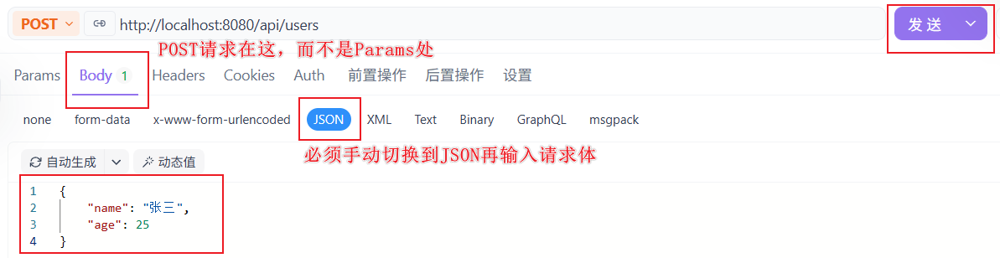

2. 获取所有的用户，因为是 get 请求，所以直接浏览器输入 

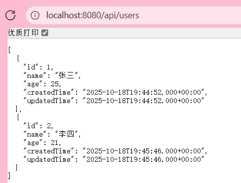


## 六、进阶

1. 修改后台的端口

在 ` src/main/resource/application.properties` 加上一行 `server.port=8001` 即可

## 七、其他写法分享

### Mapper代理开发（属于MyBatis的核心特性之一）

#### 注解方式（以上模板中使用的）

更加推荐，较为简单

#### XML方式

本人[农机互助平台项目]([WeChatMiniProgram_Agricultural-Machinery-Mutual-Aid-Platform/backend/src/main/java/com/machine/platform1 at master · zxcvbnmkj/WeChatMiniProgram_Agricultural-Machinery-Mutual-Aid-Platform](https://github.com/zxcvbnmkj/WeChatMiniProgram_Agricultural-Machinery-Mutual-Aid-Platform/tree/master/backend/src/main/java/com/machine/platform1))使用的该种方法。该方式mapper文件夹的接口中只声明方法，SQL写resource的在XML中，好处是把SQL语句和java代码分离开

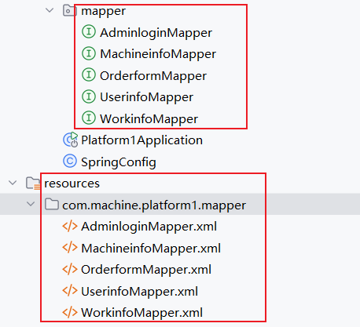
